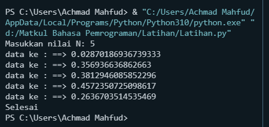
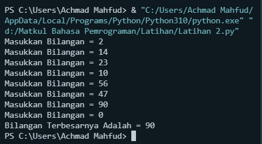
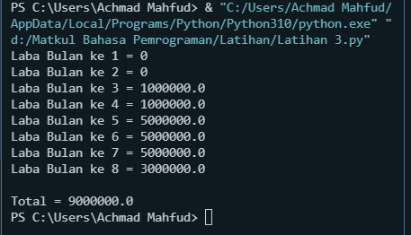

# Labpy3
## <p align="center">  **PERULANGAN ( LOOPING )**
Perualangan dalam bahasa pemrograman berfungsi menyuruh komputer melakukan sesuatu secara berulang-ulang.

**Dalam Praktek kali ini akan menggunakan _For Loop_ dan _While Loop_.**

<p align="justify"> Perulangan for disebut counted loop (perulangan yang terhitung), sementara perulangan while disebut uncounted loop (perulangan yang tak terhitung). Perbedaannya adalah perulangan for biasanya digunakan untuk mengulangi kode yang sudah diketahui banyak perulangannya. Sementara while untuk perulangan yang memiliki syarat dan tidak tentu berapa banyak perulangannya.

## **Latihan 1: [latihan1.py](Program/Latihan1.py)**
***Perintah :***
1.  Tampilkan n bilangan acak yang lebih kecil dari 0.5 .
2.  Nilai n diisi pada saat runtime
3.  Anda bisa menggunakan kombinasi while dan for untuk menyelesaikannya
  
***Program :***

```sh
print("Masukkan nilai N: 5")
import random

b = 5
a = 0
for i in range(b):
    i = random.uniform(.0, .5)
    a += 1
    print("data ke :","==>", i)
print("Selesai")
```

***Penjelasan :***
1. "print" > untuk mencetak atau menampilkan objek ke perangkat keluaran (layar) atau ke file teks.
2. "import" > fungsi lanjut yang dipanggil oleh statement import.
3. "random" > untuk menentukan suatu pilihan.
4. "range" > merupakan fungsi yang menghasilkan list. Fungsi ini akan menciptakan sebuah list baru dengan rentang nilai tertentu.
5. "uniform" > digunakan untuk menampilkan bilangan float random dengan batas awal bilangan x, dan batas akhir bilangan y.

***Output :***



## **Latihan 2: [latihan2.py](Program/Latihan2.py)**
***Perintah :***
1. Buat program untuk menampilkan bilangan terbesar dari n buah data yang diinputkan.
Masukkan angka 0 untuk berhenti.

***Program :***

```sh
max = 0
while True:
    a = int(input("Masukkan Bilangan = "))
    if max < a:
        max = a
    if a == 0:
        break
print("Bilangan Terbesarnya Adalah =", max)
```

***Penjelasan :***
1. "max" : fungsi bulid-in untuk mencari nilai tertinggi. Fungsi ini dapat diberikan sebuah parameter berupa angka.
2. "while" : disebut uncounted loop (perulangan yang tak terhitung), untuk perulangan yang memiliki syarat dan tidak tentu berapa banyak perulangannya.
3. "int" : berfungsi mengkonversi bilangan maupun string angka menjadi bilangan bulat (integer).
4. "if" = Bila suatu kondisi tertentu tercapai maka apa yang harus dilakukan. Dengan fungsi ini kita bisa menjalankan suatu perintah dalam kondisi tertentu.
5. "input" : masukan yang kita berikan ke program.
6. "break" : fungsi yang menghentikan operasi dibawahnya jika suatu kondisi yang ditentukan telah tercapai.
7. "print" : berfungsi untuk mencetak atau menampilkan objek ke perangkat keluaran (layar) atau ke file teks.

***Output :***



## **Tugas Praktikum 3**
***Perintah :***
1. Buat program sederhana dengan perulangan: [program1.py](Program/program1.py)
2. Seorang pengusaha menginvestasikan uangnya untuk memulai usahanya dengan modal awal 100 juta
3. Pada bulan pertama dan kedua belum mendapatkan laba.
4. Pada bulan ketiga baru mulai mendapatkan laba sebesar 1% dan pada bulan ke 5, pendapatan meningkat 5%
5. Selanjutnya pada bulan ke 8 mengalami penurunan keuntungan sebesar 2%, sehingga laba menjadi 3%.
6. Hitung total keuntungan selama 8 bulan berjalan usahanya.

***Program :***

```sh
modalawal = 100000000
for i in range(1, 9):
    if (i >= 1 and i <= 2):
        b = modalawal * 0
        print("Laba Bulan ke", i, "=",b)
    if (i >= 3 and i <= 4):
        c = modalawal * 0.01
        print("Laba Bulan ke", i, "=",c)
    if (i >= 5 and i <= 7):
        d = modalawal * 0.05
        print("Laba Bulan ke", i, "=",d)
    if (i == 8):
        e = modalawal * 0.03
        print("Laba Bulan ke", i, "=",e)
total = b + c + d + e
print("\nTotal =", total)
```

***Penjelasan :***
1. masukkan nilai modalawal
2. gunakan for untuk perulangan dari 1 sampai 8. Perulangan for disebut counted loop ( perulangan yang terhitung )
3. lalu gunakan if pertama untuk menentukan laba bulan ke 1 dan ke 2.masukan variabel ( b ) kalikan nilai ( amodalawal ) dengan data bulan 1 dan 2. Tampilkan ( i ) dan ( b )
4. lalu gunakan if kedua untuk menentukan laba bulan ke 3 dan ke 4.masukan variabel ( b ) kalikan nilai ( amodalawal ) dengan data bulan 3 dan 4. Tampilkan ( i ) dan ( c )
5. lalu gunakan if ketiga untuk menentukan laba bulan ke 5 sampai ke 7.masukan variabel ( b ) kalikan nilai ( modalawal ) dengan data bulan 5 sampai 7. Tampilkan ( i ) dan ( d )
6. lalu gunakan if keempat untuk menentukan laba bulan ke 8.masukan variabel ( b ) kalikan nilai ( modalawal ) dengan data bulan 8. Tampilkan ( i ) dan ( e )
7. lalu total keseluruhan.
8. Tampilkan total

***Output :***

